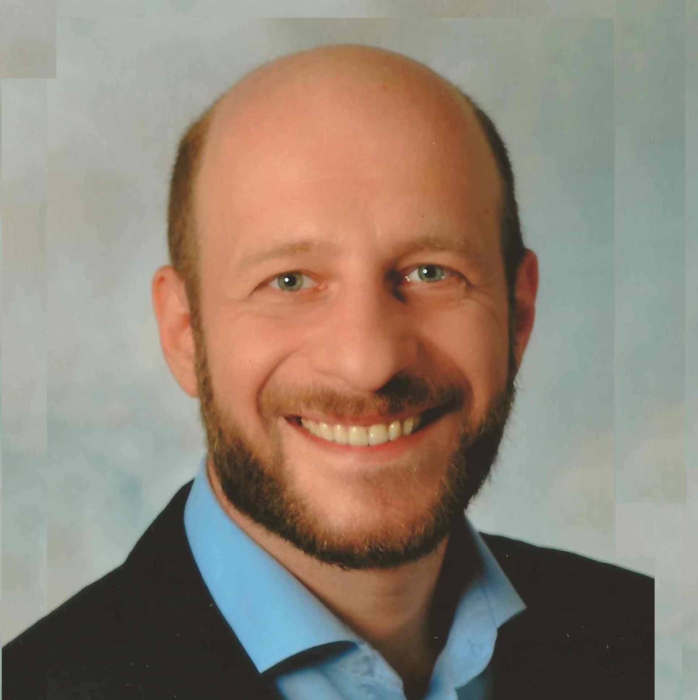

# George Mamaladze
---
{: .profile-image}

`<<< Hover over a job strip to see details here.`

`May 2022 - Present`  
__Senior Software Architect__, *Siemens AG – Factory Automation, Human Machine Interface*, Munich, Germany

The SIMATIC WinCC Unified System is a new generation of Siemens HMI and SCADA visualization products designed for industrial applications in machine building and factory automation ([siemens.com/wincc-unified](https://www.siemens.com/wincc-unified)). It addresses the modern challenges of digitization in manufacturing by providing a flexible and open platform with IT/OT integration capabilities.

**Responsibilities**
- Defining technology strategy, aligning product roadmap with business goals and partners
- Led and mentored the engineering team Architects
- Drove the technology roadmap, scanning for innovations, defining development guidelines and tool chains
- Oversaw the entire development lifecycle, allocating technical resources, collaborating with product owners, finance, and executive leadership to ensure timely delivery and market fit

**Key Achievement**
- After 3 years of development of the newly founded business line, delivered the first version of the product to market (currently in limited release, broad release planned)

`Jul 2022 - Present`  
__Chief Technical Advisor (part-time, freelance)__, *Syniotec*, Bremen, Germany (remote)

[Syniotec](https://www.syniotec.com) is a fast-growing startup providing digital solutions to the construction industry, enabling companies to optimize operations through IoT-driven telematics and software platforms. As Chief Technical Advisor, I function in practice as the part-time CTO.  

**Responsibilities**  
- Defining the technical roadmap ensuring scalability, security, and maintainability.  
- Advising the founding team and management.  
- Mentoring engineering teams on best practices in microservices, DevOps, and cloud infrastructure.  
- Managing technology stack, vendor partnerships, and integration strategies.  

**Key Achievements**  
- Established technical standards and processes that enabled Syniotec's transition from startup to scaling vendor.  
- Redesigned the cloud-native backbone of Syniotec software to scale for thousands of concurrent users and data streams.  

`May 2018 - May 2022`  
__Senior Software Architect__, *Siemens AG – Corporate Technology*, Munich, Germany

Siemens Corporate Technology served as the central research and innovation hub for Siemens AG.  

**Responsibilities**  
- Designed and conceived cloud-native system architectures for strategic projects.  
- Advised business units on cloud transformation and innovation.  
- Performed architecture reviews and mentored development teams.  
- Conducted technology research, academic collaboration, and conference talks.  

**Key Achievements**  
- Led the architecture for Spectrum Power NG digital grid control system (real-time platform with Kubernetes, Kafka, Flink).  
- Architected "Energy as a Service," a scalable microservice platform for renewable energy analytics.  

`Feb 2020 - Jun 2022`  
__Technical Trainer & Consultant__, *Independent*, Germany (part-time, freelance)

Provided training and consulting services to multiple software companies, focusing on modern cloud-native architecture and microservices implementation.

**Responsibilities**
- Created and delivered training programs on microservices architecture and cloud-native development: Microservice Patterns, Microservices implementation in Quarkus vs. Spring Boot, Testing strategies for microservices
- Conducted architecture review workshops

**Key Achievement**
- Trained over 100 developers across multiple companies, overwhelming positive feedback and measurable improvements in project outcomes

`Oct 2018 - Jan 2020`  
__International Advisor for Small Businesses (ASB)__, *EBRD (European Bank for Reconstruction and Development)*, Global (part-time, freelance)

- Provided strategic guidance and coaching to small businesses in Eastern Europe & CIS
- Mentored software teams in modern engineering practices and agile methods
- Reworked system architectures to align with business objectives
- Introduced structured processes, tools, and templates to improve execution

`Mar 2017 - Apr 2018`  
__Principal Software Architect__, *Huawei – European Research Center*, Munich, Germany

- Provided technical leadership for 3–5 concurrent high-impact research projects
- Drove project acquisition, requirement analysis, and technical consulting at HQ in China
- Disseminated research findings and knowledge

**Key Achievements** 
- Architected methodology and toolchain for modularizing large-scale Java projects. 
- Designed scalable microservice architecture for Huawei Cloud IDE.

`Jul 2009 - Feb 2017`  
__Senior Software Architect__, *Siemens AG – Digital Factory*, Fuerth, Germany

- Software Architect, promoted to Certified Senior Software Architect (2015).  
- Worked on [TIA-Portal](https://www.siemens.com/tia-portal), Siemens' flagship automation IDE, shipping 5 major releases.  
- Managed development across full stack (hardware, firmware, application).  
- Interfaced with customers and partners for product launches

`Feb 2008 - Jun 2009`  
__Senior Software Architect__, *encad Ing. mbH*, Nuremberg, Germany

- Assigned to a customer project with 50+ developers
- Conducted architecture reviews and systemic root cause analyses
- Introduced CI, static code analysis, and quality assurance measures

`Aug 2001 - Jan 2008`  
__Software Project Lead__, *IQ-optimize Software AG*, Nuremberg, Germany

- Launched Germany's first digital prepaid voucher distribution system with a 10-person team.  
- Managed lifecycle of a back-office workflow system (product ownership → development → customer training).  

`Jan 1999 - Jul 2001`  
__Head of IT Department__, *TBC Bank*, Tbilisi, Georgia

- Managed IT infrastructure, ATMs, POS systems, and integrations
- Oversaw administration and supervision of hardware and software

